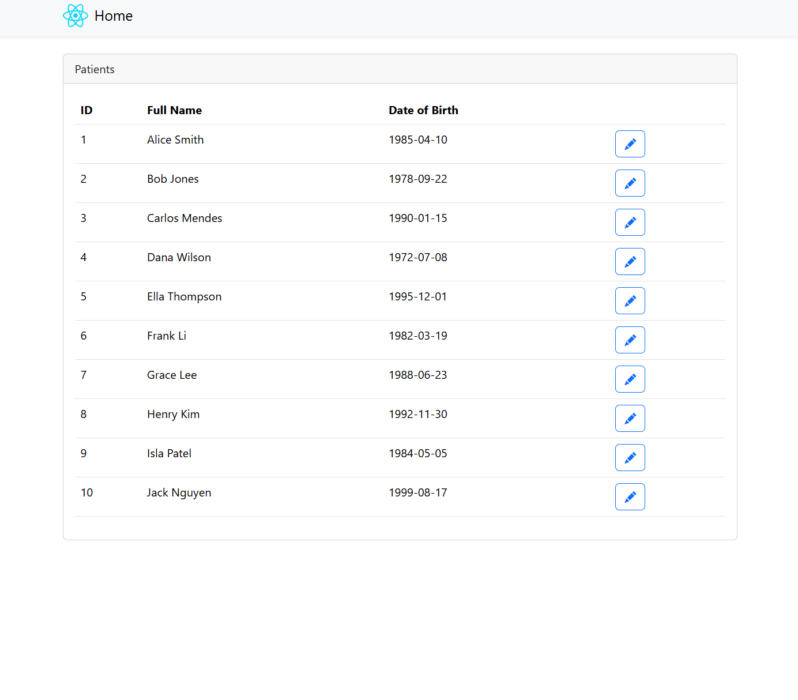
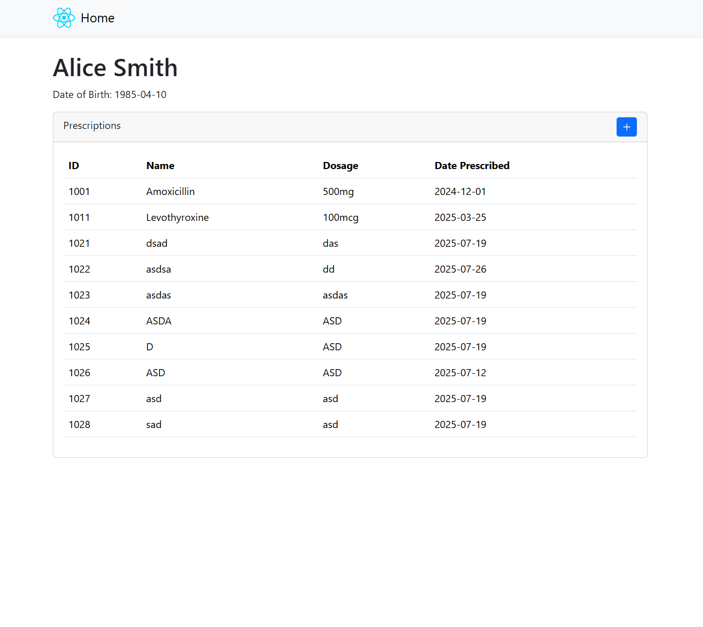
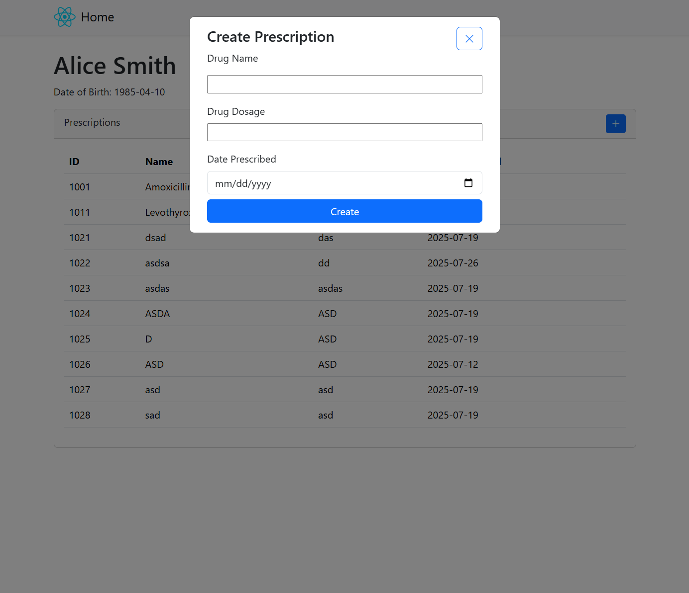

# vitura-health-assessment

## How to run the project:

Frontend: npm run dev

Backend: Launch project with 'http' profile

## Notes and Assumptions:

Even though there is an endpoint for getting all prescriptions, I decided to include the prescriptions within the GetPatientByID endpoint (which is on the Patients Details Page), assuming that in most cases the user would want to see prescriptions for a specific patient rather than all patients.

As part of the flow when creating a prescription, the user will have to navigate to the Patient Details page first, assuming that in most cases the user will want to see the patient's history before creating a prescription for them.

Bonus Parts Completed:

- Used Redux Toolkit
- Swagger for API
- Included some unit tests for backend

Time taken: 3 hours

Incomplete Parts: Filtering and sorting - ideally would like to implement this with pagination, but give time constraints I did not implement this feature.